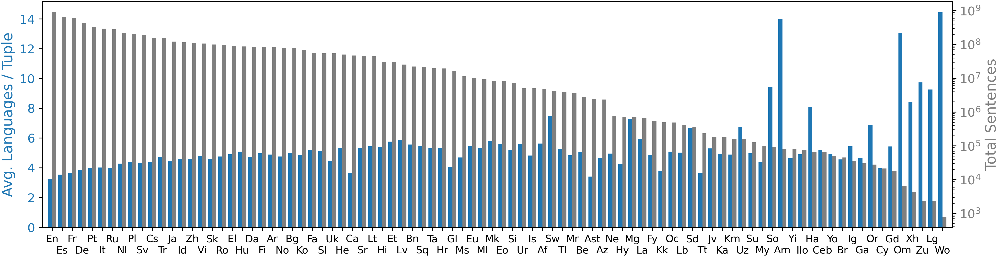
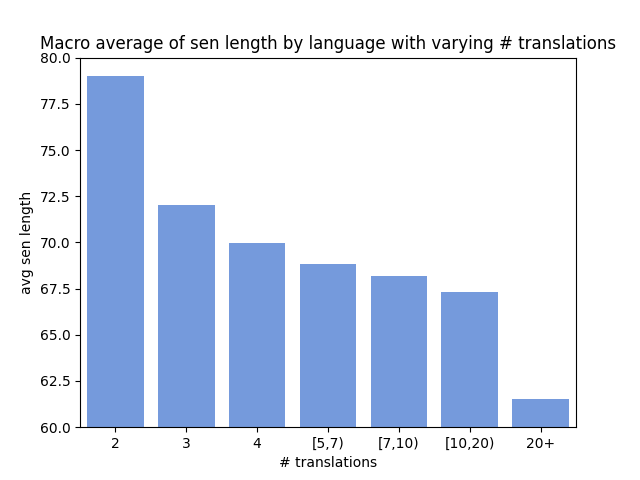
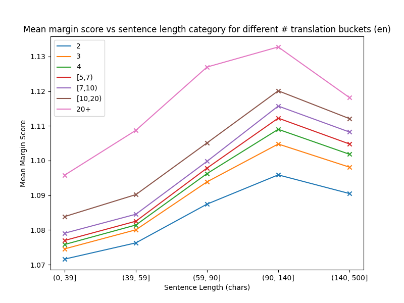

# MWccMatrix: The Web is Surprisingly Multi-Way Parallel

## Background

The [CCMatrix Dataset](https://aclanthology.org/2021.acl-long.507/) is a large multilingual dataset consisting of 10.8 billion parallel sentences for 1197 language pairs comprised of 90 languages. The dataset has been created by aligning bilingual translation pairs from multilingual data scraped from the internet by [Common Crawl](https://commoncrawl.org/).

In this work, we investigate the extent to which this data is multiway-parallel, i.e.- consists of translations for text in multiple languages. To achieve this, we combine common text across language pairs in the dataset to obtain a multiway-parallel dataset, as shown in the following figure. 


The result is a large multi-way parallel corpus containing ~2.1B translation tuples.
About 37.5% of these tuples are multi-way parallel (have > 2 translations).
The sentences are more likely to be multi-way parallel than not: of the 6.38 billion total sentences,
3.63 billion (57.1%) are in multi-way parallel (3+ languages) tuples.
We denote this multi-way parallel version of ccMatrix MWccMatrix.

We then analyze various properties of MWccMatrix and find correlations with degrees of multi-way parallelism.
We find that lower-resource languages tend to be more multi-way parallel, and explore how sentence length, perplexity, and LASER scores vary with multi-way parallelism. 

The table below shows some examples of multiway-parallel sentences in the data.

|Language |	Sentence |
| ---- | ---- |
|en	| Do not use taxis and other private vehicles because they charge you a lot of money. |
|es	| No use taxis y otros vehículos privados porque le cobran mucho dinero. |
|zh	| 不要使用出租车和其他私人车辆，因为他们向你收取很多钱。 |
|fa	| از وسایل حمل و نقل عمومی استفاده کنید چرا که تاکسی ها هزینه زیادی از شما دریافت می کنند. |
|	|  |
|en	| Moreover, the two most dangerous drugs — and tobacco can be acquired in almost any country. |
|de	| Darüber hinaus, zwei der gefährlichsten Rauschgifts — und Tabak kaufen, können Sie sicher in fast jedem Land. |
|nl	| De gevaarlijkste drugs ter wereld, alcohol en nicotine, kun je bijna overal ter wereld kopen. |
|zh	| 此外，两个最危险药物—；和烟草获取可在几乎任何国家。 |
|no	| Videre, de to mest farlige stoffer — og tobakk kan være kjøpt i nesten alle land. |
|ko	| 또한,두 개의 가장 위험한 마약—그리고 담배에서 획득 할 수있다 거의 모든 나라입니다. |
|	|  |
|en	| It was 1873, not 4, when our Order was founded, Captain,' she was saying. |
|zh	| 那是1873年,不是4,我们的订单成立时,队长,”她在说什么。 |
|	|   |
|en	| The venue originally inaugurated in 1947 will maintain its capacity of more than 80,000, although the seating sections may be redesigned. |
|pt	| O estádio originalmente inaugurado em 1947 vai manter a sua capacidade de pouco mais de 80.000 espectadores, embora setores possam ser remodelados. |
|zh	| 最初在1947年落成的场地将保持其超过80,000的容量，虽然座位部分可能重新设计。 |
|	|   |
|en	| My goal became to simply sit. |
|fr	| Ma seule pensée à l’heure actuelle était de m’asseoir. |
|de	| Alles, was ich jetzt noch will, ist mich hinzusetzen. |
|it	| L’obiettivo è arrivare a stare semplicemente seduti. |
|ru	| Наша задача – хотя бы сесть. |
|fi	| Minun tavoitteeni on vain ylipäänsä päästä istumaan.|
|ja |	先生、せめて座ろうよ。|
|	| |
|en |	The current social demand for computers is gradually increasing, from a small controller chips, to high-performance servers have been all covered by this major’s knowledge. |
|zh |	当前社会对于计算机的需求正逐步增大，从小小的控制器芯片，到高性能服务器都被该专业覆盖。|
|   |   |	
|en |	22% Health and Wellnes |
|es |	32% Salud y belleza |
|pt |	22% Saúde e Bem-Estar; |
|pl |	-21% Krew i piękno |
|sv |	20 % skönhet och hälsa |
|tr |	20 güzellik ve sağlık |
|vi |	Sức khỏe và vẻ đẹp 20 |


## Navigating the code
* [Data Creation](data_creation/README.md)

Code to create the multiway parallel data from the CCMatrix dataset


* [Data Analysis](data_analysis/README.md)

Scripts for automatic analysis of the created multiway parallel data. The analysis includes basic data statistics, sentence lengths, margin score, and perplexity for varying degrees of multiway parallelism.

We find that lower-resource languages exhibit higher degrees of multi-way parallelism-



Additionally, we find that content with more translations tends to be shorter-



We also found a correlation between the number of translations and the margin-scores and perplexity of the sentences -




More details of the experiments as well as the scripts to generate the statistics and plots can be found in [Data Analysis](data_analysis/README.md).


* [MT Experiments](mt_experiments/README.md)

Scripts to extract bitext / bitext subsets for MT experiments

* [WMT Data Analysis](wmt_data_analysis/README.md)

Code for analyzing the [WMT data](https://huggingface.co/datasets/RicardoRei/wmt-mqm-human-evaluation) and labels. Specifically, we study the correlation between MQM scores and source sentence lengths and laser cosine similarities for MT versus human generated translations as well as for varying source sentence lengths.

We find that in addition to preferring MT to human output, LASER produces higher scores for longer sentences.

en-de            |  zh-en            |  en-ru
:-------------------------:|:-------------------------:|:-------------------------:
 |  | 


We also find a strong correlation between the source sentence lengths and MQM, with longer source sentences having worse MQM scores. (Note that data for the pairs en-de and zh-en are annotated with Google’s MQM framework while the data for en-ru uses Unbabel’s variant of the MQM framework, which counts up instead of down and thus flips the trend of the scores.)

en-de            |  zh-en            |  en-ru
:-------------------------:|:-------------------------:|:-------------------------:
 |  | 


MT also tends to have a lower perplexity than human translations (measured with GPT-2)


## Environment

To create a new environment with conda-

```commandline
conda create -n ccmatrix_env python=3.9
```

The following versions of packages need to be installed for running the MWccMatrix creation and analysis codes-

```commandline
pip install cykhash==2.0.1  # MIT, https://github.com/realead/cykhash
pip install Cython==0.29.36  # Apache 2.0, https://cython.org/
pip install datasets==2.14.4 # Apache 2.0, https://github.com/huggingface/datasets
pip install evaluate==0.4.0  # Apache 2.0, https://github.com/huggingface/evaluate
pip install pandas==2.0.3  # BSD-3, https://github.com/pandas-dev/pandas
pip install scipy==1.11.2  # BSD-3, https://github.com/scipy/scipy
pip install seaborn==0.12.2  # BSD-3, https://github.com/mwaskom/seaborn
pip install sentence-transformers==2.2.2  # Apache 2.0, https://github.com/UKPLab/sentence-transformers/blob/master/LICENSE
pip install sentencepiece==0.1.99  # Apache 2.0, https://github.com/google/sentencepiece
pip install tokenizers==0.13.3  # Apache 2.0, https://github.com/huggingface/tokenizers
pip install torch==2.0.1  # based on BSD-3, https://github.com/pytorch/pytorch/blob/main/LICENSE
pip install torchvision==0.15.2  # BSD-3, https://github.com/UiPath/torchvision/blob/master/LICENSE
pip install matplotlib==3.7.2  # PSF (Python 3), https://matplotlib.org/stable/users/project/license.html
pip install numpy==1.25.2  # based on BSD-3, https://numpy.org/doc/stable/license.html
pip install transformers==4.32.1  # Apache 2.0, https://github.com/huggingface/transformers
pip install laserembeddings==1.1.2  # BSD-3, https://github.com/yannvgn/laserembeddings
pip install nltk==3.8.1  # Apache 2.0, https://github.com/nltk/nltk
pip install scikit-learn==1.3.0  # BSD-3, https://github.com/scikit-learn/scikit-learn/blob/main/COPYING
pip install spacy==3.6.1  # MIT, https://github.com/explosion/spaCy
```

## Citation

Please cite this work as:

```bibtex
@misc{thompson2023mwccmatrix,
      title={MWccMatrix: The Web is Surprisingly Multi-Way Parallel}, 
      author={Thompson, Brian and Dhaliwal, Mehak Preet and Frisch, Peter and Domhan, Tobias and Federico, Marcello},
      year={2023}
}
```

## Security

See [CONTRIBUTING](CONTRIBUTING.md#security-issue-notifications) for more information.

## License

This project is licensed under the Apache-2.0 License.

