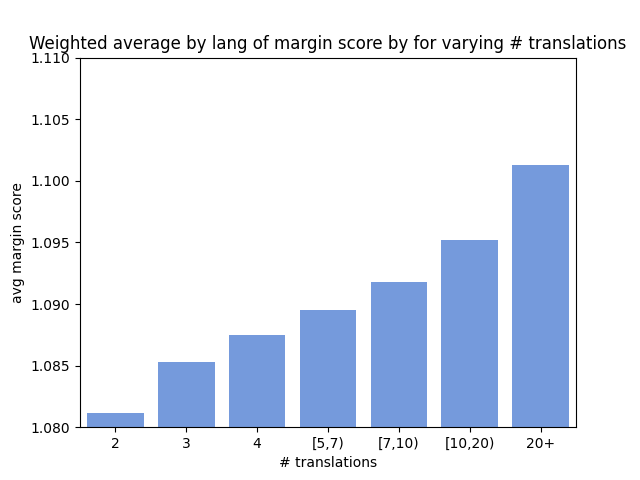

  Copyright Amazon.com, Inc. or its affiliates. All Rights Reserved.
  
  Licensed under the Apache License, Version 2.0 (the "License").
  You may not use this file except in compliance with the License.
  You may obtain a copy of the License at
  
      http://www.apache.org/licenses/LICENSE-2.0
  
  Unless required by applicable law or agreed to in writing, software
  distributed under the License is distributed on an "AS IS" BASIS,
  WITHOUT WARRANTIES OR CONDITIONS OF ANY KIND, either express or implied.
  See the License for the specific language governing permissions and
  limitations under the License.

# Data Analysis 

After data creation, we analyze various properties of the multiway parallel translation dataset. This directory contains the automatic analysis scripts along with the generated plots and statistics.

The scripts correspond to the following analyzes-

1. [Data Statistics](#data-statistics)
2. [LASER Margin Score](#margin-score)
3. [Perplexity](#perplexity)


# Data Statistics

The following scripts perform a basic statistical analysis of the data.

* [compute_table_stats.py](compute_table_stats.py)

    Computes values for measuring basic statistics of the data including degrees of multiway-parallelism (i.e.- number of translations of an example), counts of sentences, languages, language pairs and language triplets. It also analyzes the distribution of sentence lengths for different degrees of multiway-parallelism.

    All calculated values are saved in the file `stats/stats.pkl` and further used for displaying the statistics and plots for analysis.

    On an i4i.32xlarge instance (128vCPU, 1,024 GiB memory, 6Tb gp2 disk) instance, the script takes ~10 min to execute.

    To run:
    ```commandline
    python3 compute_table_stats.py
    ```

* [plot_table_stats.py](plot_table_stats.py)
    
    This script analyzes the values in the `stats/stats.pkl` file and displays the following statistics of the data (The values shown are based on our created data):

    | Property | Value |
    | ---- | ---- |
    | Number of rows | 2,185,509,877 |
    | Number of sentences | 6,377,522,643 |
    | Multiway parallel content (> 2 translations) in data | 37.47% |
    | Max number of translations for a sentence | 83 | 
    | Average translations | 2.918 |
    | Average translations excluding bitext pairs |	4.45 |
    | Average translations per language (Macro) | 5.508 |
    | Average translations per language (Weighted) | 4.151 |
    | Average translations in the top 10 highest resource languages (Macro) | 3.952 |
    | Average translations in the top 10 lowest resource languages (Macro) | 8.553 |

    About 37.47% of the translation tuples are multiway parallel, and about 3.63 billion (57.1%) of the 6.38 billion total sentences are in multi-way parallel (3+ languages) tuples.
    Additionally, the difference in average number of translations for the highest and lowest resource languages indicates that lower resource languages exhibit a higher degree of multiway parallelism. 

    This phenomenon is explored further in the following plots. These plots are generated through the same script and saved in the [plots/](plots/) directory.

    * **Fraction of Sentences vs Number of Translations**
        
        We analyze the fraction of content for different degrees of multiway parallelism.

        

        From the figure, we can see that the amount of data decreases exponentially as we increase the number of translations. In the next figure, we analyze how multiway parallelism varies for different languages.
        
    * **Comparison of average translations for different languages, along with their counts in the original data**
        
        The blue bars show the average number of translations for content in each language. The gray bars indicate the log of the total sentences for each language in MWccMatrix. The trend shows that the average number of translations increases sharply for low-resource languages.
        
        

    * **Heatmap displaying probability of a language being translated into another language**
        
        We also plot the probability of a language being translated into another language based on their occurrence in MWccMatrix.
        
        

        From the heatmap, we can observe that in general, nearly all languages are most likely to have parallel data in the highest resource languages. We also see some logical exceptions, such as Spanish (es) ↔ Catalan (ca), and Russian (Ru) ↔ Ukrainian (uk). There is also a high amount of parallel data for Indonesian (id) ↔  Malay (ms) and Turkish (tr) ↔ Azerbaijani (az). [Note: it’s possible these are artifacts of data collection (e.g. LID errors, LASER errors), especially in the lowest resource languages]

    * **Heatmap displaying probability of a bitext being translated into a third language**
        
        We additionally analyze the probability of a bitext being translated into a third language from our multiway parallel data.

        

        We observe that bitexts for most language pairs tend to also be translated in high resource languages, particularly English, which could be pivot languages. Similar to the previous plot, we also see some logical connections, such as a higher probability of Dutch (nl)-Norwegian (no) and Portuguese (pt)- Romanian (ro) bitext pairs being also having a translation in Swedish (sv) and Italian (it) respectively.

    * **Average sentence length by language with varying number of translations**    
        
        We also analyze the variation in sentence lengths of content with different degrees of multiway parallelism. We obtain the statistics per language and plot the macro average as well as the average weighted by the amount of content for each language in MWccMatrix.

        Macro Average             |  Weighted Average
        :-------------------------:|:-------------------------:
          |  

        Both trends indicate that shorter sentences are more likely to be multi-way parallel.

    The plotting code executes in a few seconds on an i4i.32xlarge instance (128vCPU, 1,024 GiB memory, 6Tb gp2 disk) instance.
    
    To run:
    ```commandline
    python3 plot_table_stats.py
    ```

# LASER Margin Score

* [compute_marginscore_stats.py](compute_marginscore_stats.py)

    This script analyzes the variation in margin score of data with different degrees of multiway parallelism. Since margin score indicates the quality of a translation pair (based on their [Laser embedding](https://github.com/facebookresearch/LASER), this analysis would indicate whether there is a correlation between multiway parallelism and the quality of translations.

    We use the cutoff value of the margin score bucket from which the sentences were added to the multiway parallel data as a proxy for the actual margin score.

    Additionally, for a specified list of languages (set in the variable `marginscore_with_len_analysis_list` in [utils.py](utils.py)), we also save the scores and sentence lengths for sentences with different degrees of multiway parallelism.

    All statistics from this script are also saved in the subdirectory [stats/](stats/).

    On an i4i.32xlarge instance (128vCPU, 1,024 GiB memory, 6Tb gp2 disk) instance, this script takes ~15 minutes to execute when statistics with length are calculated for English (en).

    To run:
    ```commandline
    python3 compute_marginscore_stats.py
    ```

* [plot_marginscore_stats.py](plot_marginscore_stats.py)

    This script uses the saved statistics for margin scores and generates the following plots-

    * **Average over all languages of margin score by for varying number of translations**

    Macro Average             |  Weighted Average (by data for each language in MWccMatrix)
    :-------------------------:|:-------------------------:
      |  

    The plots above indicate that parallel data with more translations tend to have a higher margin score. 
    
    Note: our [analysis](../wmt_data_analysis/README.md) of the average cosine similarity using Laser embeddings on WMT 2020-2022 data indicates that LASER actually has a strong preference for machine translation over human translation. This is consistent with the LASER model being based a small, multilingual machine translation model.

    We also find that in addition to preferring MT to human output, LASER produces higher scores for longer sentences. Since sentence length increases with number of translations, we measure separate margin score statistics for content of varying lengths for 3 high resource language pairs, en, es and fr in the figures below. While LASER scores tend to increase with length, the trend of higher scores for more translated content remains. 

    en           |  es           |  fr
    :-------------------------:|:-------------------------:|:-------------------------:
     |  | 
    
    To run:
    ```commandline
    python3 plot_marginscore_stats.py
    ```

    On an an i4i.32xlarge instance (128vCPU, 1,024 GiB memory, 6Tb gp2 disk) instance, this script takes ~15 minutes to generate plots for es and fr.

# Perplexity

We analyze the perplexity of 100,000 English sentences uniformly sampled from bins for different degrees of multiway parallelism. The perplexity is measured using the [perplexity](https://huggingface.co/spaces/evaluate-metric/perplexity) metric from Huggingface's [Evaluate](https://huggingface.co/docs/evaluate/index) module. The model used for perplexity analysis is [GPT-2](https://huggingface.co/gpt2).

* [sample_sentences_per_bin.py](sample_sentences_per_bin.py)

    This script samples a specified number of sentences of a given language from different degrees of multiway parallelism bins. All these values are defined in [utils.py](utils.py). 

    We ran the sampling script on an i4i.32xlarge instance (128vCPU, 1,024 GiB memory, 6Tb gp2 disk) instance. For sampling 100k English sentences, the script took around 15 minutes to run.

    The sampled sentences are stored in a subdirectory `sampled_sens`.

    To run:
    ```commandline
    python3 sample_sentences_per_bin.py
    ```    

* [perplexity_analysis.py](perplexity_analysis.py)

    This script measures perplexity for the data in the `sampled_sens` subdirectory using the [perplexity](https://huggingface.co/spaces/evaluate-metric/perplexity) metric and stores the values in [stats/](stats/).

    We ran this script on a p3.2xlarge instance (8vCPU, 61 GiB memory, 4Tb gp2 disk). For measuring perplexity using [GPT-2](https://huggingface.co/gpt2) for 100k English sentences each from 7 multiway parallelism degree bins, the script took ~1.5 hours to execute.

    To run:
    ```commandline
    python3 perplexity_analysis.py
    ```  

* [plot_perplexity_analysis.py](plot_perplexity_analysis.py)

    This script plots the measured perplexity values.

    * **Average perplexity of 100k English sentences from different multiway parallelism degree buckets**
        
        

        The plot indicates increasing perplexity with an increasing number of translations in the data. 

        From our analysis of sentence lengths, we know that data with more translations tends to be shorter than data with few translations. 
        Therefore, we plot the perplexity analysis while grouping sentences based on their lengths.

    * **Perplexity for sentences of different lengths from different multiway parallelism degree buckets**

        Mean Perplexity            |  Median Perplexity
        :-------------------------:|:-------------------------:
          |  

        The perplexity plots for sentences of varying lengths confirms that perplexity is generally higher for shorter sentences and decreases for longer sentences. Additionally, after normalizing for sentence length, the trend observed for perplexity of sentences with varying degrees of multi-way parallelism indicates decreasing perplexity for content with increasing number of translations. 

    To run this script:
    ```commandline
    python3 plot_perplexity_analysis.py
    ```  

    On a p3.2xlarge instance (8vCPU, 61 GiB memory, 4Tb gp2 disk), the script took a few seconds to run.


In addition to running each script individually, the basic data statistics, margin score and sampling sentences for perplexity analysis can be run with the following command:

```commandline
bash run.sh
```  

The perplexity analysis and plotting codes can be executing by running:

```commandline
bash run_ppl.sh
```  

