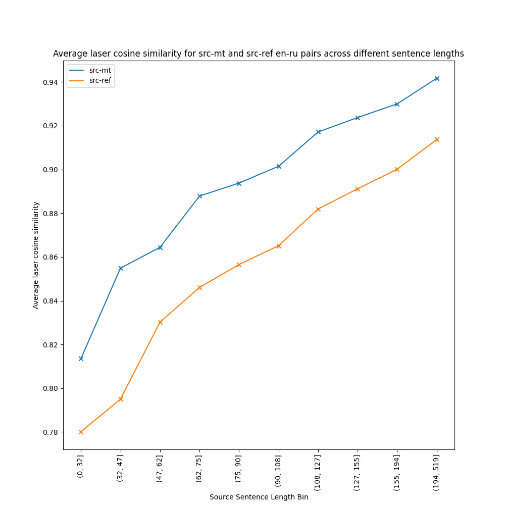
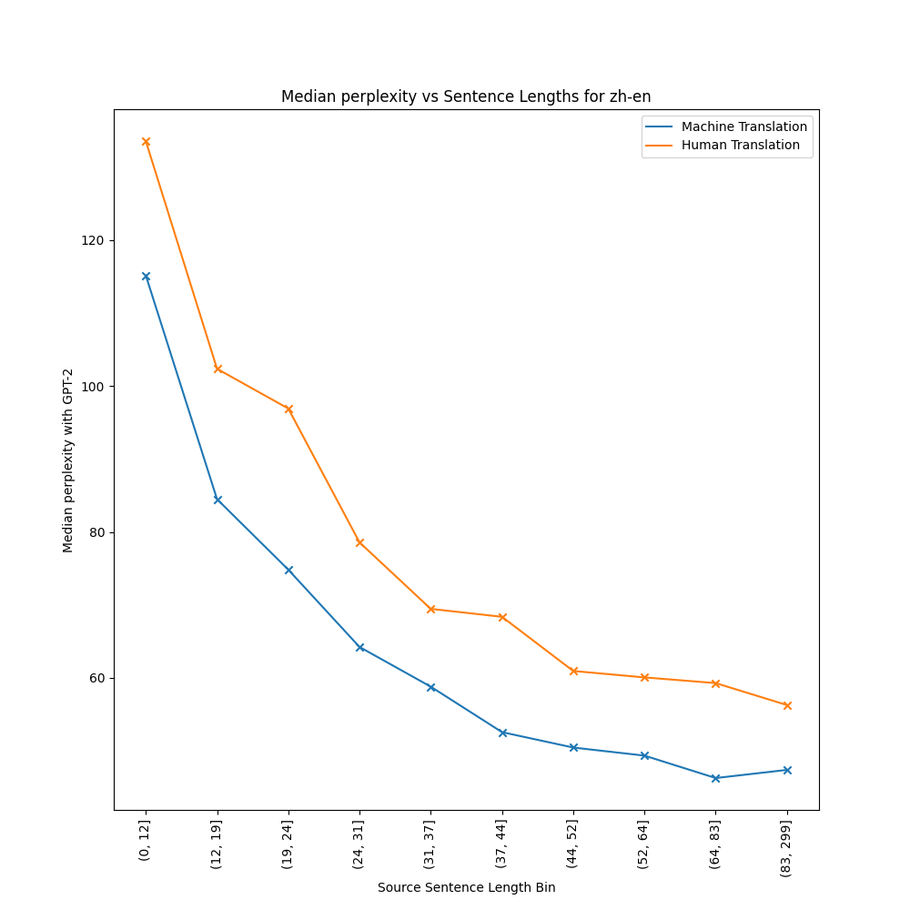

  Copyright Amazon.com, Inc. or its affiliates. All Rights Reserved.
  
  Licensed under the Apache License, Version 2.0 (the "License").
  You may not use this file except in compliance with the License.
  You may obtain a copy of the License at
  
      http://www.apache.org/licenses/LICENSE-2.0
  
  Unless required by applicable law or agreed to in writing, software
  distributed under the License is distributed on an "AS IS" BASIS,
  WITHOUT WARRANTIES OR CONDITIONS OF ANY KIND, either express or implied.
  See the License for the specific language governing permissions and
  limitations under the License.

# Data Analysis

We use the [WMT 2020-2022](https://huggingface.co/datasets/RicardoRei/wmt-mqm-human-evaluation) data and labels to analyze whether there is a correlation between MQM labels (which indicate translation quality) and source sentence lengths.

We also analyze the relation between the average cosine similarity of laser embeddings for source and target sentences with the length of the source sentence. We maintain a distinction between reference and mt target sentences and find that laser prefers mt over human written translations.

The following plots are generated from the script `data_analysis.py`. 

* **Average MQM scores for varying sentence length bins**

en-de            |  zh-en            |  en-ru
:-------------------------:|:-------------------------:|:-------------------------:
 |  | 


We observe a strong correlation between the source sentence lengths and MQM, with longer source sentences having worse MQM scores.

* **Average laser cosine similarity for src-ref and src-mt with varying sentence length bins**

en-de            |  zh-en            |  en-ru
:-------------------------:|:-------------------------:|:-------------------------:
 |  | 

From the analysis, we find that --
1. LASER produces higher scores for longer sentences
2. LASER consistently scores machine translations higher than the corresponding human translations


Command for running the script:
```commandline
python3 data_analysis.py
```

This code was run on an i4i.32xlarge instance (128vCPU, 1,024 GiB memory, 6Tb gp2 disk) instance.

We also analyze the median perplexity (measured with GPT-2) for human and machine translations of varying source sentence lengths. The trend indicates that-
1. MT tends to have a lower perplexity than human translation
2. Perplexity tends to be higher for shorter sentences



Command for running the analysis:
```commandline
python3 perplexity_analysis.py
```

Command for generating plots:
```commandline
python3 plot_perplexity_stats.py
```

These scripts were tested on an EC2 p3.2xlarge instance (8vCPU, 61 GiB memory, 4Tb gp2 disk)